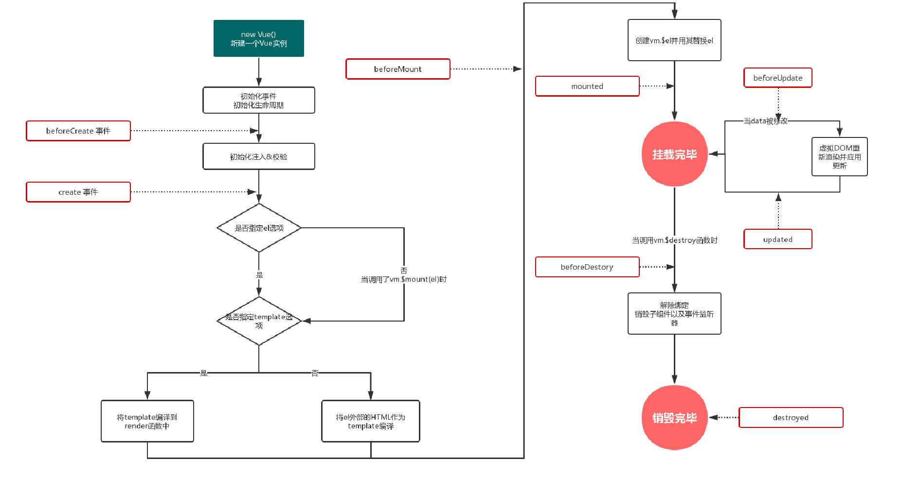

#### MongoDB连接数据库
##### 一、简介

使用MongoDb连接数据库，需要下载MongoDB和Robo 3T

官网：[https://www.mongodb.com/]
手册：[https://docs.mongodb.com/manual/]
传统的数据库都是结构性数据库，如MySQL、SQL Server、Oracle、Access等数据库。有行和列的概念，数据有关系并且数据不是散的。每个表中，都有明确的字段，每行记录，都有这些字段，不能有的行有，有的行没有。
MongoDB是由C++语言编写的，是一个基于分布式文件存储的开源数据库系统。MongoDB 将数据存储为一个文档，数据结构由键值(key=>value)对组成。MongoDB 文档类似于 JSON 对象。字段值可以包含其他文档，数组及文档数组。

##### 二、安装步骤
1. 打开下载链接：
[https://www.mongodb.com/try/download/community]
(如果是32位的，用这个地址:[http://dl.mongodb.org/dl/win32/x86_64])

2. 选择对应的下载版本,下载msi程序


3. 下载完毕后进行安装，默认或者自定义都可以（建议默认）

4. 安装的过程中注意不要勾选‘Install MongoDB Compass’。MongoDB Compass是一个图形界面管理工具，不安装没有问题的，我们用<a href='https://robomongo.org/'>Robo 3T</a>这个图形界面管理工具。


5. 如果安装过程中出现了这个提示，就选择忽略掉。

6. 安装完成后,创建数据目录
MongoDB把数据存储在db目录下，但是这个数据目录不会主动创建，我们在安装完成后需要创建它。这里要注意的是，数据目录应该放在根目录下（比如C:\或者D:\）
这里我的MongoDB装在了C盘，所以我的数据目录也建在C盘,我这里用cmd操作的方便大家看过程，大家可以不用cmd，直接创建目录就行。


7. 进入C:\Program Files\MongoDB\Server\4.2\bin目录下，打开cmd，执行mongod --dbpath C:\data\db(mongod -dbpath命令是选择数据库文件存放的位置)命令执行成功会出现以下提示：


8. 连接MongoDB在bin目录中打开cmd输入mongo.exe|mongo就连接上数据库了,退出mongodb使用exit命令。


##### 三、详细使用

C:\Program Files\MongoDB\Server\4.2

1.新建个文件夹，是用来存放数据库的。

2.在mongoDb 4.2下打开cmd 输入：mongod   -dbpath    刚才新建文件的路径。即连接到这个文件夹。完事后会出现好多内容在文件夹中。

开启数据库。首先在bin目录下开启，通过换届变量配置之后就可以全局打开用了。复制到bin的那层文件路径，打开此电脑->属性>系统高级设置>环境变量>找到path,编辑>新建>复制刚才的路径>确定。就可以全局打开使用了。mongo.exe开启数据库。

之后使用的时候直接在任意位置打开cmd.  mongod   -dbpath 要连接到的文件夹url. 就会连接成功。

然后在bin目录下打开cmd  输入mongo.就启动成功了。

第一步需要连接数据库，建议大家配置好环境变量。然后打开cmd，执行mongo命令

命令|作用
---|---
mongo|使用数据库
show dbs|列出所有数据库
use 数据库名字|使用和新建数据库
db|查看当前操作的数据库
db.数据库名称.insert() 括号里传入内容|插入数据
db.数据库库名称.find()要是查全部的则不需要传内容|查找数据
db.数据库名称.update()|修改数据
db.数据库名称.remove()|删除数据
db.数据库名称.drop()|删除集合
db.dropDatabase() 。首先要找到他的目录里面|删除数据库

db.test.find({"age":{$lt:17}}) //找到年龄小于17的

db.test.find({"age":{$gt:17}}) //找到年龄大于17的

db.test.update({"name":"tintin"},{$set:{"age":12}}) //把tintin的年龄改为12

 db.test.update({"name":"xinxin"},{"name":"haha"})  //把xinxin,改为haha

db.test.remove({"age":{$lt:13}})  //删除年龄小于13的所有数据

### 四。node.js连接数据库.express

一。创建文件
1.创建个文件夹。在该目录下打开cmd.输入express --view=ejs express-mongo创建目录
2.cd express-mongo
3.npm i
4.npm start 就可以访问3000端口了。一个express框架就跑起来了。

二。连接到数据库
1.npm i mongodb
2.开启mongo
3.文件下建立libs文件夹，再建立config.js。

```js
//config.js文件里面：为了全局都可以使用到，所以写到全局config.js里面。需要导出一下
var MongoClient = require("mongodb").MongoClient //引入mongodb包，实例化连接对象
var url = "mongo://127.0.0.1:27017/test" //连接数据库的地址，以及具体库

module.exports = async function (){ //config.js文件里面：为了全局都可以使用到，所以写到全局config.js里面。需要导出一下。为了确保一定可以练到，则使用async await
    const client = await MongoClient.connect(url,{useNewUrlParser:true}，(err,client)=>{
        if(){}else{}
    }) //连接数据库
    console.log("数据库连接成功")
    let db = client.db("test")  //重新选择一下数据库
    return db  //把它返回出来。才能对数据库进行操作。
    //为了保证能够成功连接到数据库，所以用了async和await
}
//导出的是个函数
//引包，地址，连接数据库。重新选择数据库
```

4.执行的时候连接数据库。在app.js里面

```js
//导入的时候是个函数
//在app.js里面全局引入一下，就可以全局使用了。不然的话在每个里面都得引入，麻烦。
var mdb = require("./libs/config")  //将导出的config.js文件引入。他是个函数
//mdb() 不可以采用这样的方式，用下面的

var db;  //用来接收导出函数的执行
(async ()=>{
    db =await mdb()  //确保导入函数的执行
})()
//接着npm start 就会显示数据库连接成功

//完事之后通过use中间件，把数据库引入过来
app.use('/test',require('./routes/test'))
```

5.对数据库进行一些操作。在routes文件下创建test.js文件

```js
var express = require('express');
const { Db } = require('mongodb');
var router = express.Router();

//1.查找数据   db.collection("数据库").find()
router.get('/', function(req, res, next) {
//   res.render('test',{title:'express'});
  //需求：读取数据库中的数据，并且把数据渲染到test.ejs的页面中去
  //db.collection("数据库").      数据库
  let result = db.collection("test").find()
  //我们的mongodb存储的数据是BSON的一种类json的二进制数据格式
  //所以需要使用toArray()方法当中的回调函数得到其中的数据
  result.toArray((err,data)=>{
      console.log(data)
      //把ejs内容渲染到页面
      res.render('test',{results:data})
      res.end()
  })
});

//2.插入数据db.collection('数据库').insert
router.get('/insert',function(req,res,next){ 
//插入一条数据    
    //db.collection('test').insertOne({"name":"兴兴","age":23},(err,result)=>{
    if(err){console.log(err,"数据链连接失败") return}
    else{
        console.log("写入数据成功)
        db.close()  //一般的增删改查都要关闭一下数据库
        cosole.log("关闭数据库成功")
    }
    
    
//插入多条数据       
    db.collection('test').insertMany([{"name":"兴兴","age":23},{"name":"婷婷","age":18}],(err,result)=>{
        if(err){
            console.log("数据库连接失败")
            return
        }
        res.send("写入数据库成功")
        db.close()
        console.log("关闭数据库成功")
    })
})

//3.修改数据db.collection('test').update（{原先的},{改完的},{multi:true}） true:默认修改所以符合条件的。false:修改满足条件的第一条
router.get('/update',function(req,res,next){ 
    //修改数据    当multi为true是默认修改所以满足条件的，false是修改满足条件的第一条。
        db.collection('test').update({"name":"兴兴","age":23},{"name":"兴兴","age":99},{multi:true},(err,result)=>{
            if(err){
                console.log("数据库连接失败")
                return
            }
            res.send("修改数据库成功")
            db.close()
            console.log("关闭数据库成功")
        })
    })

//4.删除数据db.collection('数据库').remove({要删除的内容}) 
router.get('/remove',function(req,res,next){ 
    //插入一条数据    
        //db.collection('test').insertOne({"name":"兴兴","age":23},(err,result)=>{
    //插入多条数据        
        db.collection('test').remove({"name":"兴兴","age":23},(err,result)=>{
            if(err){
                console.log("数据库连接失败")
                console.log(err)
                return
            }
            res.send("删除数据库成功")
           
            console.log("关闭数据库成功")
        })
    })  


module.exports = router;
```


6.对上述内容的封装

（1）主要操作config.js。把里面内容进行封装好，在test.js里面直接函数调用

```js
1.封装连接数据库的函数
async connectDB function(url){
    //引包
    var MongoClient = require("mongodb").MongoClient
    //连接数据库
    var client = await MongoClient.connect(url,{useNewParse:true})
    console.log("数据库连接成功")
    return client //方便后续操作关闭数据库
}
```

```js
2.封装插入数据库函数
exports.insert = async function(collectionName,json){
   //连接数据库
   let url = "mongo://localhost:27017:test"
   var client = connectDB(url)
   //重新选择下数据库
   let db = client.db(collectionName)
   //要进行的插入操作
   db.collection(collectionName).insertOne(json,(err,result)=>{
       if(err){
           console.log(err)
           console.log("插入失败")
           return
       }
       console.log("插入数据库成功")
       client.close().then(()=>{
           console.log("数据库关闭成功")
       })
   })
}
```

（2）app.js里面还和上面未封装的一致

（3）test.js里面调用一下。

```js
let db = require("../libs/config") //引入一下config导出的内容
db.insert("test",{"name":"兴兴"})  //通过.insert调用
```

node  test.js


在cmd中进行数据库的增删改查

​    查看数据库：show dbs

   使用或新建数据库：use   test    比如新建test数据库

   插入数据：insert       db,test.insert({"name":"xinxin"})

  查看数据库中的数据：db.test.find()  就会查出test数据库中的数据

 查询条件 ：比如查找年龄小于19的    db.test.find({"age":{$lt:19}})

​                              查找年龄大于17的    db.test.find({"age":{$gt:17}})

修改数据：比如修改name是xinxin的年龄改为22.  db.test.update({"name":"xinxin"},{$set:{"age":22}})

​                            把name是xinxin修改为name是tintin    db.test.update({"name":"xinxin"},{"name":"haha"})

删除数据：romove   比如删除name是xinxin的    db.test.remove({"name":"xinxin"})