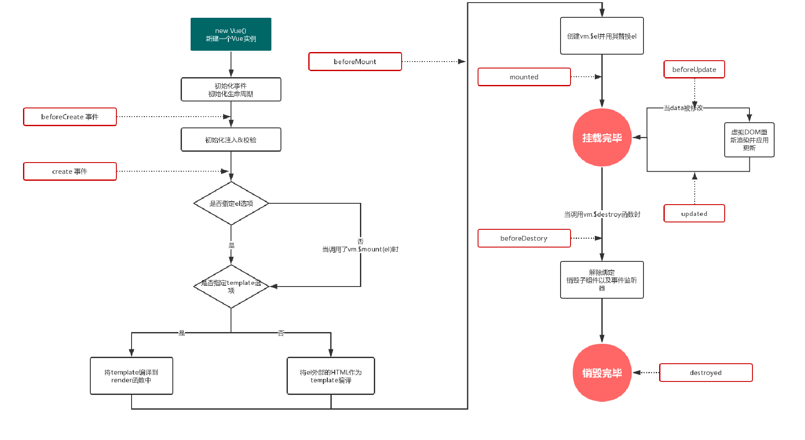

#### Vue组件知识
##### 一、组件化应用构建
组件系统是Vue的另一个重要概念，因为它是一种抽象，允许我们使用小型、独立和通常可复用的组件构建大型应用。所以几乎任意类型的应用界面都可以抽象为一个组件树。一个组件本质上是一个拥有预定义选项的一个 Vue 实例。


##### 二、父子组件的数据传递之props
prop是你可以在组件上注册的一些自定义特性，当一个值传递给一个prop特性的时候，它就变成了那个组件实例的一个属性。一个组件可以拥有任意数量的prop,任何值都可以传递给任何prop。
来看看下面这个例子：

效果如下：


##### 三、父子组件的数据传递之监听子组件事件
1. 直接在父组件定义一个函数
2. 在父组件定义一个样式数据，再在子组件定义一个自定义事件，并且事件触发父组件内的函数数据。
3. 子组件直接把自定义事件绑定到click事件上，并为函数提交了一个参数。 

四。组件使用

1.首先由个div标签来包裹组件。

```html
<div id="app">
    <car-component></car-component>
</div>
```

2.创建vue实例

```js
const app = new Vue({
    el:"#app",
    data:{},
    methods:{},
    components:{
       //创建的组件名称
        CarComponent
    }
})
```

3.创建组件

```js
const CarComponent = {
	name:"CarComponent", //组件名称
	template:"#car-component",  //组件模板
	data(){
	   return{
	      
	   }
	}
}
```

4.抽离模板

```js
<template id="car-component">
    <div>
        <input type="text" class="inp" v-model = "count">
    </div>
</template>
```

5.综合使用

```html
<!DOCTYPE html>
<html lang="zh">
<head>
    <meta charset="UTF-8">
    <meta name="viewport" content="width=device-width, initial-scale=1.0">
    <title>xinxin</title>
    <script src="https://cdn.jsdelivr.net/npm/vue/dist/vue.js"></script>
    <style>
      
    </style>
</head>
<body>
   <div id="app">
       <car-component></car-component>
   </div>

   <template id="car-component">
        <div class="car">
            <button> - </button>
            <input type="text" class="inp" v-model="count">
            <button> + </button>
        </div>
   </template>

   <script>
       //2.定义购物车组件
       const  CarComponent = {
           name:"CarComponent",
           template:"#car-component",
           data(){
               return {
                   count:""
               }
           },
           methods:{
            //定义一个方法    
           }
       }

       //1.vue实例对象
       const app = new Vue({
           el:"#app",
           components:{
               CarComponent
           },
           data:{
               list:[{
                   name:"华为",
                   price:1000
               },{
                   name:"oppo",
                   price:9999
               }]
           }
       })
   </script>
</body>
</html>
```

