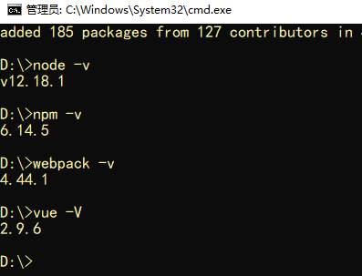

#### vue-cli学习
##### 一、准备工作
需要安装node、webpack、vue-cli
安装webpack之后检查版本的时候可能会叫我们安装webpack-cli，按照提示安装即可。

```cmd
npm i webpack -g
npm i vue-cli -g
```
下载node网址。https://nodejs.org/en

下载cnpm淘宝镜像

通过径像在cmd中下载cnpm。输入：npm install -g cnpm --registry=https://registry.npm.taobao.org

cnpm完事之后还得npm i一下，防止漏包。

cnpm -v查看cnpm版本

安装完之后检查一下,如下图出现对应的版本号即为成功。
注意:vue -V是大写的V

每次使用前都检查一下



##### 二、使用脚手架
初始化一个项目名称为demo的vue项目
```cmd
vue init webpack demo
```


安装完成会出现如下提示：


接下来按照提示操作即可运行程序


打开浏览器访问http://localhost:8080即可看到一个vue项目


接下来我们来看一下这个vue项目的目录文件的作用


当功能改变之后还得需要打包一下。npm run build  会生成一个dist文件。


创建内容。1.先在components里创建组件，比如login.vue

​					2.在router的index.js里面引入组件，添加路由

每次需要在地址里输入才能打开，麻烦。需要配置一下。在config的index.js中找到autoOpenBrowser: true,设置为true

在router的index.js中设置mode:'history'就不会有#了。

```js
//路由实现切换
login.vue
<template>
    <div>
        这是登录页面
        <router-link to="/home">去home页面</router-link>
    </div>
</template>>


home.vue
<template>
    <div>
        这是home页面
        <router-link to="/login">去login页面</router-link>
    </div>
</template>>


```

项目完成后要npm run build进行打包，当上传到服务器上去则只需要把dist文件上传就可以